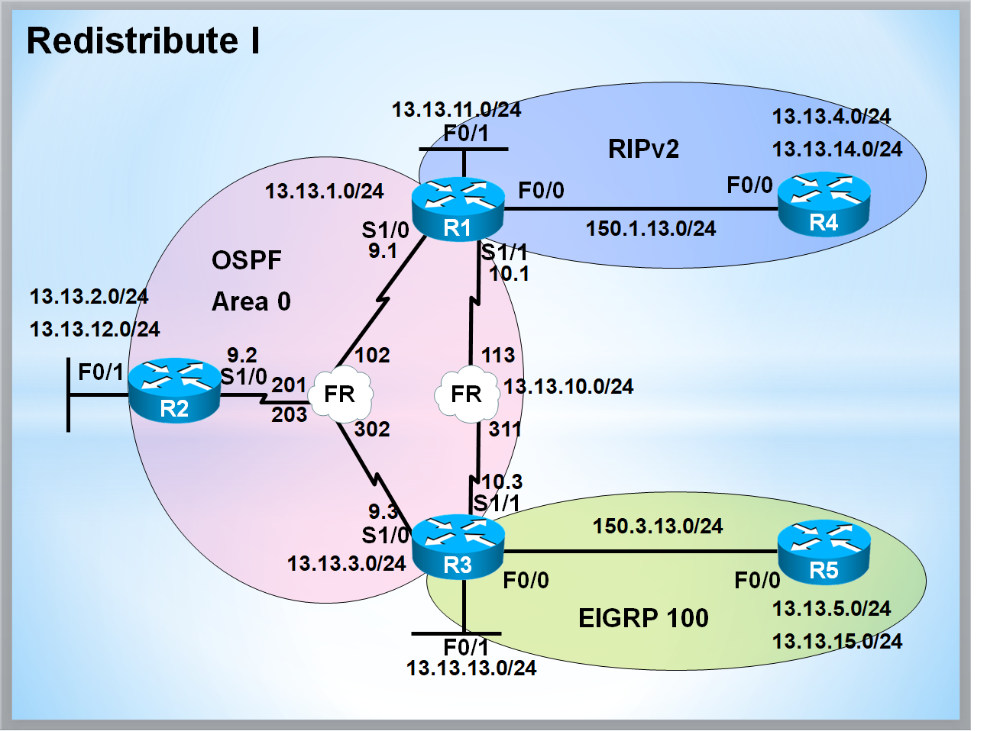

# Redistribute-Study

> Cisco 라우터 환경에서 **Redistribute(재분배)** 를 학습하기 위한 실습 정리 저장소입니다.
> OSPF / RIPv2 / EIGRP 간의 상호 재분배와 Route-map / Prefix-list 기반 필터링 재분배를 다룹니다.

---

## 📑 Topology

| 구간 | Protocol | 비고 |
|------|----------|------|
| R1 - R2 - R3 (Frame-Relay) | OSPF Area 0 | R2 = Hub (DR) |
| R1 - R3 (Frame-Relay) | OSPF Area 0 | Point-to-Point |
| R1 - R4 | RIPv2 | R1의 Fa0/1 포함 |
| R3 - R5 | EIGRP AS 100 | R3의 Fa0/1 포함 |

---

## 📂 Chapters

### 1. 기본 환경 구성
- [01. Initial Configuration](./01-Initial-Config.md)
- [02. IGP - OSPF (Frame-Relay)](./02-IGP-OSPF.md)
- [03. IGP - RIPv2 (R1↔R4)](./03-IGP-RIPv2.md)
- [04. IGP - EIGRP (R3↔R5)](./04-IGP-EIGRP.md)

### 2. 기본 Redistribute
- [05. Connected → OSPF](./05-Redistribute-Connected.md)
- [06. RIPv2 → OSPF](./06-Redistribute-RIPv2-to-OSPF.md)
- [07. EIGRP → OSPF](./07-Redistribute-EIGRP-to-OSPF.md)
- [08. OSPF → RIPv2](./08-Redistribute-OSPF-to-RIPv2.md)
- [09. OSPF → EIGRP](./09-Redistribute-OSPF-to-EIGRP.md)

### 3. Filtering을 사용한 Redistribute
- [10. Connected Filtering (Route-map)](./10-Filter-Connected.md)
- [11. RIPv2 → OSPF Filtering](./11-Filter-RIPv2-to-OSPF.md)
- [12. OSPF → RIPv2 Filtering (Offset-list)](./12-Filter-OSPF-to-RIPv2.md)
- [13. EIGRP → OSPF Filtering (Metric/Tag)](./13-Filter-EIGRP-to-OSPF.md)
- [14. OSPF → EIGRP Filtering (Tag)](./14-Filter-OSPF-to-EIGRP.md)

---

## 📊 OSPF External Metric 정리

| 구분 | Metric Type | 특징 | 기본 Metric |
|------|------------|------|-------------|
| O E1 | Type 1 | 누적 (External + Internal Cost) | 누적 |
| O E2 | Type 2 | 고정 (External Cost만 사용) | 20 |

| 변환 방향 | 필요 옵션 |
|-----------|----------|
| → OSPF | `subnets` 옵션 권장 (VLSM 광고) |
| → RIPv2 | `metric N` 필수 (1~15) |
| → EIGRP | `metric BW DLY REL LOAD MTU` 필수 |

---

## 🔗 Related Repository

- [Frame-Relay-Basic-Study](https://github.com/KSNAM97/Frame-Relay-Basic-Study)
